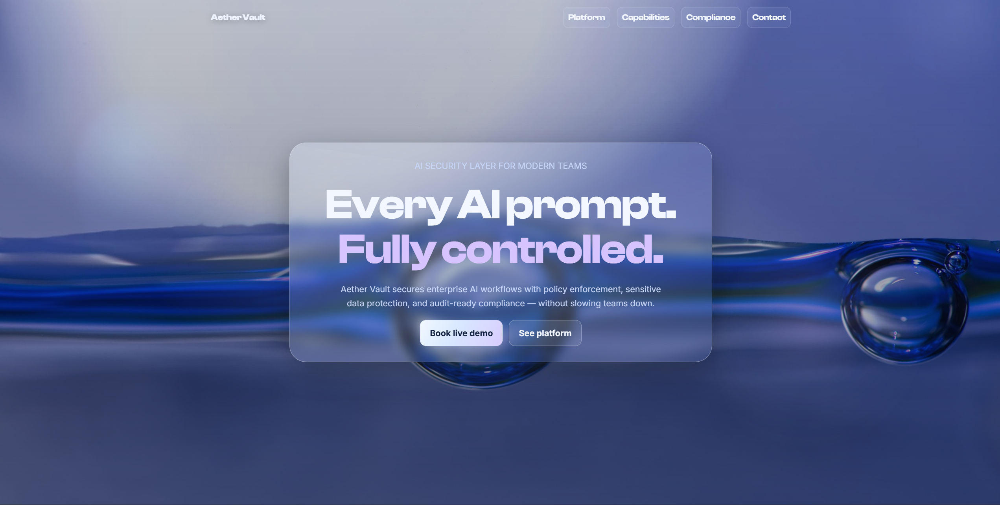

# Aether Vault — Enterprise AI Security Landing Page

---

A premium, glassmorphism-driven marketing site for **Aether Vault**, an enterprise platform that secures AI workflows with policy enforcement, data protection, and audit-ready compliance.

Built as a high-conversion B2B landing page with strong visual hierarchy, modern motion, and accessibility-conscious interaction patterns.

---

## Overview

**Aether Vault** is presented as the security layer between teams and LLM tools.  
The page communicates product value through:

- clear enterprise messaging,
- architecture-first storytelling,
- trust/compliance signals,
- refined UI interactions.

This project focuses on combining **brand-level visual design** with practical UX and performance discipline.

---

## Key Features

- **Premium Hero Section**
  - Liquid glass card
  - Organic animated blobs
  - Parallax depth layers
  - Strong CTA focus

- **Enterprise Content Structure**
  - Platform capabilities
  - Security architecture flow
  - Integrations
  - Compliance/trust blocks
  - FAQ + final conversion CTA

- **Design System Consistency**
  - Clash Display for headings
  - Inter for readable body text
  - Visual rhyming across cards, nav, and buttons
  - Blue/purple cyber-security palette

- **Micro-interactions**
  - Reveal-on-scroll animations
  - Tilt and magnetic hover interactions
  - Smart floating navbar behavior
  - Custom branded scrollbar

- **Accessibility & UX**
  - Semantic HTML sections
  - Keyboard-visible focus states
  - Reduced motion support
  - Balanced text hierarchy and contrast tuning

---

## Tech Stack

- **HTML5**
- **CSS3** (custom properties, glassmorphism, responsive layout)
- **Vanilla JavaScript** (no framework)
- Optional local font assets (Clash Display variable font)

---
